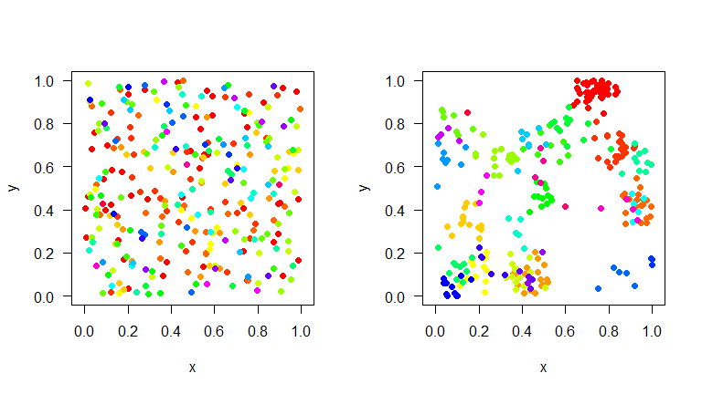
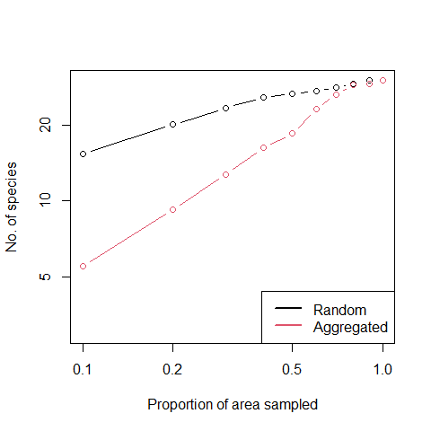
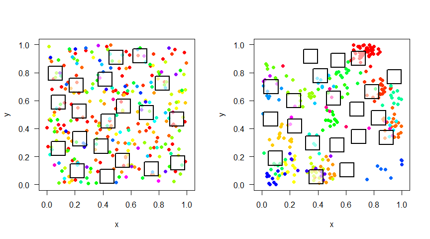

<!-- README.md is generated from README.Rmd. Please edit that file -->

[](https://cran.r-project.org/package=mobsim)
[](https://CRAN.R-project.org/package=mobsim)

[](https://www.gnu.org/licenses/gpl-3.0.en.html)

[](https://www.repostatus.org/)

[](https://doi.org/10.5281/zenodo.1170472)

[](https://github.com/MoBiodiv/mobsim/actions)

## Overview

The goal of the package `mobsim` is to facilitate understanding of
scale-dependent biodiversity changes.

The package includes functions to simulate species distributions in
space with controlled abundance distributions as well as controlled
intraspecific aggregation. For analysis there are functions for species
rarefaction and accumulation curves, species-area relationships,
endemics-area relationships and th distance-decay of community
similarity.

A detailed introduction of the package is available at
[bioRxiv](https://www.biorxiv.org/content/10.1101/209502v1).

## Installation

``` r
# The easiest way to get mobsim is to install from CRAN:
install.packages("mobsim")

# Or the development version from GitHub:
# install.packages("devtools")
devtools::install_github("MoBiodiv/mobsim", build_vignettes = TRUE)
```

Please enter bug reports on
[github](https://github.com/MoBiodiv/mobsim/issues).

## Getting help

You can get an overview of the available functions in `mobsim`:

``` r
?mobsim
```

Or have a look at tutorials in the vignette:

``` r
browseVignettes("mobsim")
```

## Examples

Here is an example of how to simulate two communities, which just differ
in their spatial aggregation of species, but have the same species
abundance distribution and the same total number of individuals.

### Simulation of communities

``` r
library(mobsim)
comm_rand <- sim_poisson_community(s_pool = 30, n_sim = 300)
comm_agg <- sim_thomas_community(s_pool = 30, n_sim = 300, sigma = 0.05, mother_points = 1)
```

``` r
par(mfrow = c(1,2))
plot(comm_rand)
plot(comm_agg)
```

<!-- -->

<!---->

### Analysis of spatially-explicit community data

`mobsim` mobsim offer functions to analyse spatially-explicit community
data. For example the species-area relationship of a community can be
easily evaluated.

``` r
sar_rand <- divar(comm_rand)
sar_agg <- divar(comm_agg)
```

``` r
plot(m_species ~ prop_area, data = sar_rand, type = "b", log = "xy",
     xlab = "Proportion of area sampled",ylab = "No. of species",
     ylim = c(3,30))
lines(m_species ~ prop_area, data = sar_agg, type = "b", col = 2)
legend("bottomright", c("Random","Aggregated"), col = 1:2, lwd = 2)
```

<!-- -->

<!--  -->

### Sampling of communities

Simulated or observed communities can be also sampled inorder to test
whether biodiversity changes are correctly detected and revealed by any
sampling design.

``` r
par(mfrow = c(1,2))
samples_rand <- sample_quadrats(comm_rand, avoid_overlap = TRUE)
samples_agg <- sample_quadrats(comm_agg, avoid_overlap = TRUE)
```

<!-- -->

<!-- -->
