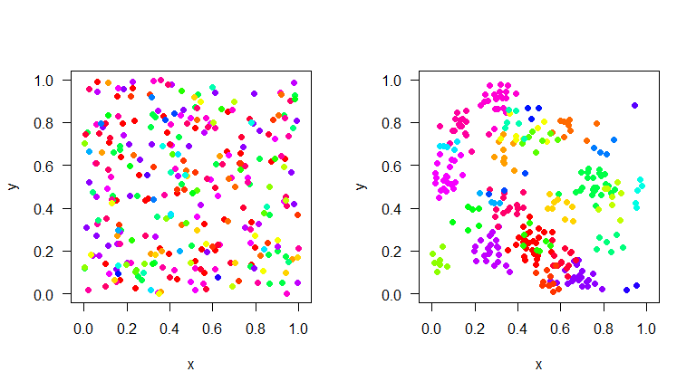

<!-- README.md is generated from README.Rmd. Please edit that file -->
mobsim
======

The goal of the package is to facilitate understanding of scale-dependent biodiversity changes.

The package includes functions to simulated species distributions in space with controlled abundance distributions as well as controlled intraspecific aggregation. For analysis there are functions for species rarefaction and accumulation curves, species-area relationships, endemics-area relationships and th distance-decay of community similarity.

Installation
------------

You can install mobsim from github with:

``` r
# install.packages("devtools")
devtools::install_github("MoBiodiv/mobsim", build_vignettes = TRUE)
```

Getting help
------------

You can get an overview of the available functions in mobsim:

``` r
?mobsim
```

Or have a look at tutorials in the vignette:

``` r
browseVignettes("mobsim")
```

Example
-------

Here is an example of how to simulate two communities, which just differ in their spatial aggregation of species, but have the same species abundance distribution and the same total number of individuals.

``` r
library(mobsim)
comm_rand <- sim_poisson_community(s_pool = 30, n_sim = 300)
comm_agg <- sim_thomas_community(s_pool = 30, n_sim = 300, sigma = 0.05, mother_points = 1)
```

``` r
par(mfrow = c(1,2))
plot(comm_rand)
plot(comm_agg)
```


